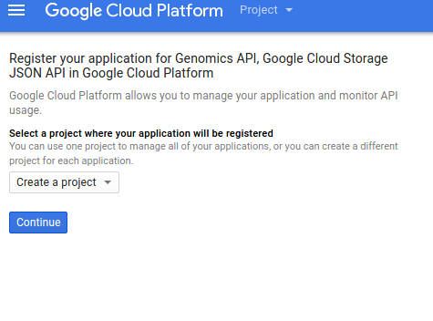
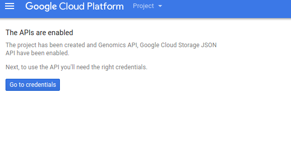
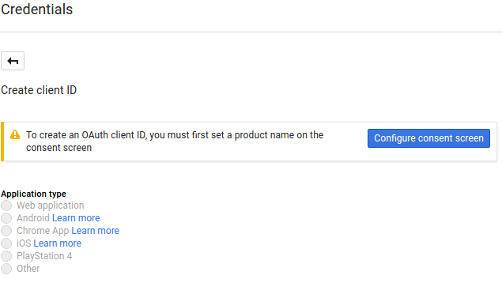
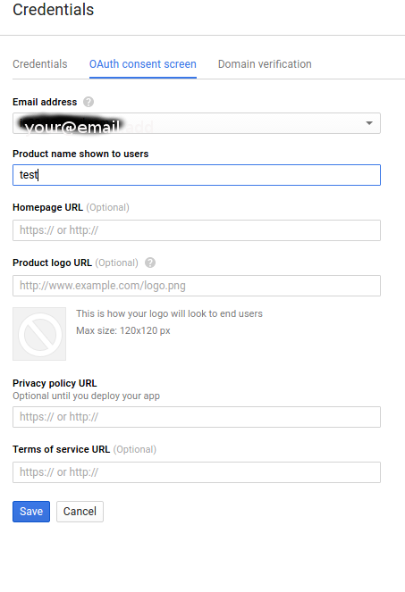
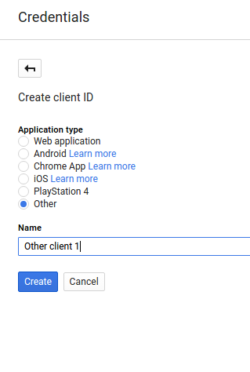
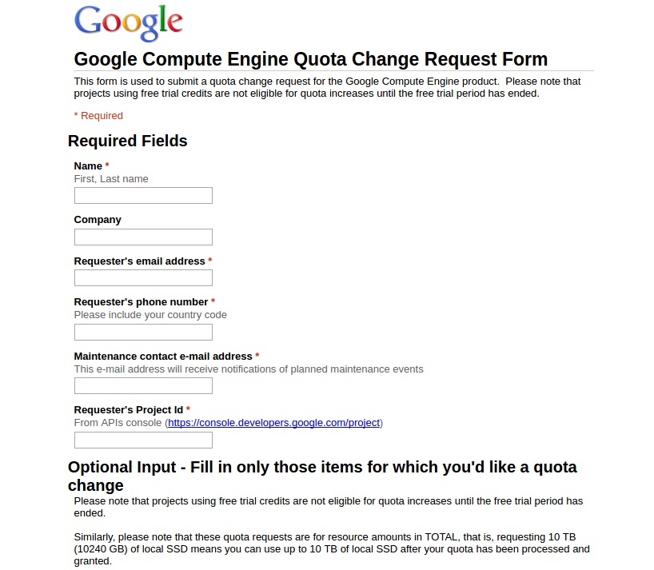
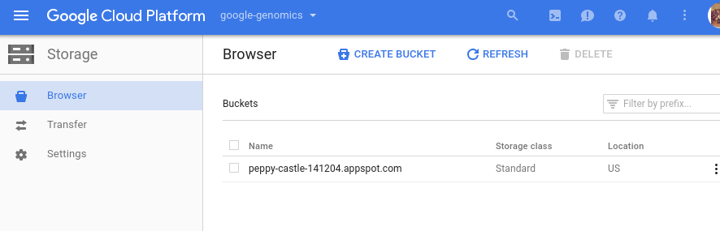

___
[TOC]
___

# google cloud platform 에서 GATK 사용하기
(*이 자료는 아래 [원본 구글 GATK 사이트](https://cloud.google.com/genomics/gatk)의 내용을 번역하고 약간의 설명을 더한 자료입니다*)
## 자료
* 원본 구글 GATK 사이트: [https://cloud.google.com/genomics/gatk](https://cloud.google.com/genomics/gatk)
* GATK 강의 사이트: [https://software.broadinstitute.org/gatk/guide/presentations](https://software.broadinstitute.org/gatk/guide/presentations)
* 지난 Bigbio 강의 자료: [https://github.com/biospin/BigBio/tree/master/part05/week02_160705](https://github.com/biospin/BigBio/tree/master/part05/week02_160705)

## 설명
*GATK는 상업 라이선스가 따로 있어서인지 먼저 alpha version 사용자로 사용허가를 받아야만 사용 가능하다*

### 순서
1. Get Ready
2. Prepare input data
3. Run GATK

### Get Ready
#### Request access: 
**alpha 사용자 요청**을 해서 승인을 받아야 함. 승인이 나야 뒤에 있는 GATK package를 내려받을 수 있음
#### Prerequisites: 
왠만한 컴퓨터에서는 다 가능함. OS는 linux나 Mac OS X. 프로그램은 java 1.5 이상, python2.6 이상
#### Sign up: 
free trial 이상을 사용하고 있어야 함. Genomics-enabled project 를 생성하고 해당하는 API를 활성화 하고 credentials를 내려받아야 함
아래 원문의 말과 실제 웹페이지의 이름이 약간씩 다름. 그림을 확인할 것

1. Create a [Genomics-enabled project](https://console.cloud.google.com/start/api?id=genomics,storage_api&_ga=1.100450072.789946969.1471575985) via the Google Cloud Platform Console. (The Cloud Storage JSON API must also be enabled.)


2. Once your project has been created, click Go to credentials.

3. Open the Add Credentials dropdown and select OAuth 2.0 client ID.

4. If you are creating a Client ID for a new project, you will be required to set up the OAuth consent screen. The consent screen will be displayed any time an application using your Client ID requests access to private data. If prompted:
Click Configure consent screen and follow the instructions to set a "Product name" to identify your Cloud project in the consent screen.


Save your changes to return to creating your Client ID.
5. On the Create Client ID page:
 1. Under Application type, select **other**.
 2. Click Create.
 
6. Your new Client ID has been created. Close the confirmation dialog and click the download icon on the right to save your new Client ID.
7. Rename the downloaded file to client_secrets.json and copy it to your home directory.

#### Confirm quotas: 
(현재 free trial 중으로 대상이 아님)

#### Install the Google Cloud SDK: 
이전에 설치했던 것과 상관없이 다시 설치하였음
1. ```curl https://sdk.cloud.google.com | bash```
2. 다시 터미널 재시작
3. ```gcloud auth login```
4. ```gcloud config set project ``` *PROJECT-ID*
여기서 *PROJECT-ID*는 위에서 만든 project 아이디를 입력하면 됨. [http://console.cloud.google.com](http://console.cloud.google.com) 에서 확인 가능

#### Install the GATK Google tools
```bash
gsutil cp gs://gatk-alpha/gatk-google-client.zip .
unzip gatk-google-client.zip
```
하면 된다는데 현재 alpha user 승인이 나지 않아 불가능함.
```403 forbidden error ```
```bash
gsutil ls gs://gatk-alpha/
```
해보면 
```bash
gs://gatk-alpha/gatk-alpha-3.4-wgs-20160330.json
gs://gatk-alpha/gatk-google-client-2015-07-28.zip
gs://gatk-alpha/gatk-google-client-2015-09-27.zip
gs://gatk-alpha/gatk-google-client-original.zip
gs://gatk-alpha/gatk-google-client-staging.zip
gs://gatk-alpha/gatk-google-client.zip
gs://gatk-alpha/resources/
```
가 나옴. 하지만 복사는 안 됨

#### Create a bucket for your results
```gsutil``` 을 사용하는 방법과 web console을 사용하는 방법이 있음

