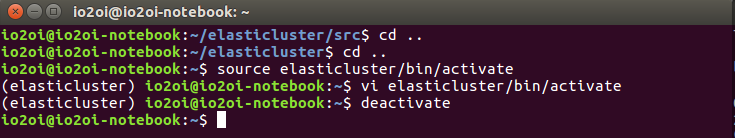
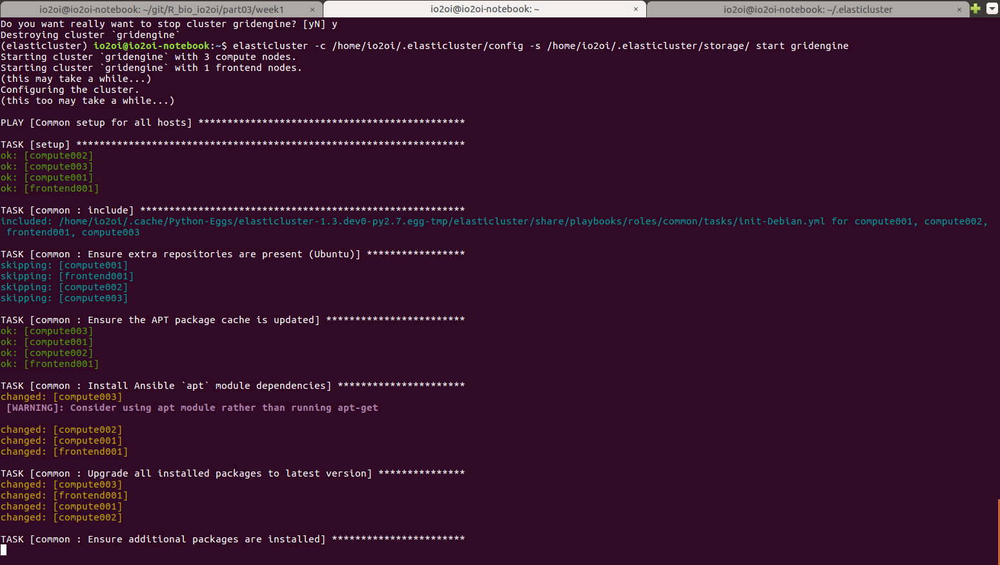
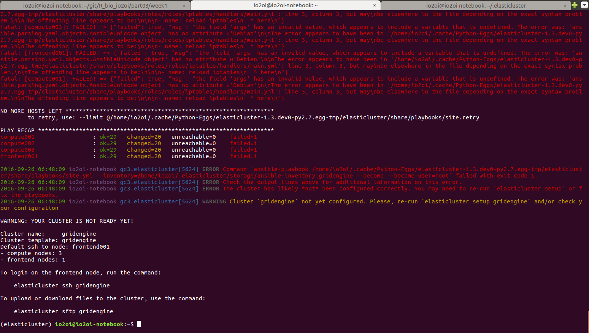
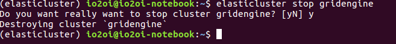

이 문서는 아래의 연결을 간략하게 정리한 것이다.
[연결](http://googlegenomics.readthedocs.io/en/latest/use_cases/setup_gridengine_cluster_on_compute_engine/index.html)
# Create a Grid Engine cluster on Compute Engine
이 문서는 elastic cluster를 사용하여 grid engine 을 이용한 클러스터 작업을 관리하는 소프트웨어 사용에 관한 것이다.
elasticcluster 는 comman line tool을 제공하는데 이를 통해서 Grid engine, SLURM, Apache Hadoop 등을 관리하고 설정을 할 수 있다. 

## What you will do
By following the instructions in this document, you will learn to:

1. 설치 Install Elasticluster software on your workstation/laptop
1. GCP에 연결 Configure Elasticluster to access your Google Cloud Project
1. VM 설정 Configure a cluster of Compute Engine virtual machines running Grid Engine
1. cluster시작 Start a cluster of Compute Engine virtual machine running Grid Engine
1. cluster목록 List nodes of your cluster
1. 파일 복사 Copy files to the master instance of your cluster
1. ssh 연결 SSH to the instances of your cluster
1. cluster 삭제 Destroy your cluster
1. 갱신 Update your Elasticluster installation

## Install Elasticluster on your workstation/laptop
virtualenv 를 이용해서 작업을 하기 때문에 먼저 virtualenv 가 설치되어있어야 한다.
없을 경우 아래와 같이 실행한다.
```shell
]$ sudo pip install virtualenv
```
만약 사용자만을 위해 설치하고자 한다면
```shell
]$ sudo pip install --user virtualenv
```
1. elasticluster를 설치할 디렉토리로 옮긴다.
1. ```virtualenv```명령어를 이용하여 디렉토리 생성한다.
```shell
]$ virtualenv elasticluster
```
1. 활성화 한다
```shell
]$ source elasticluster/bin/activate
```
나중에 ```deactivate``` 명령어로 ```virtualenv```를 해지할 수 있음

1. elasticluster 설치
두가지 방법이 있다. github (mainline) 을 이용하거나 github (google genomics fork) 를 이용하는 방법이다. 문서에서는 첫번째를 추천하고 있다.
 1. From github (mainline)
 ```
cd elasticluster
git clone git://github.com/gc3-uzh-ch/elasticluster.git src
cd src
python setup.py install
```
  1.From github (googlegenomics fork)
  ```
cd elasticluster
git clone https://github.com/googlegenomics/elasticluster.git src
cd src
python setup.py install
```
나의 경우 1번을 실행하고 있는데 error 발생
  - libffi 에러와 ssl.h 가 없는 문제는 아래와 같이 해서 해결
  ```]$ sudo apt-get install libffi-dev libssl-dev```
  - dist must be a distribution instance 에러 
  ```elasticluster/lib/python2.7/distutils/``` 아래에 ```cmp.py``` 가 없어서 생기는 문제 
  ```shell
  ]$ cp $HOME/anaconda2/lib/python2.7/distutils/cmd.py ../lib/python2.7/distutils/
  ```
  해서 해결. (정확한 이유를 아는 분 설명 부탁)
  
##  Create your cluster definition file
GCP project 에 접근하기 위해서는 반드시 ```.elasticluster/config``` 파일을 생성해야 한다.

config 파일에는 다음과 같은 내용이 들어간다. \*\*\*\* 부분에 본인의 것을 채워 넣어야 한다 
```
# Gridengine software to be configured by Ansible
[setup/ansible-gridengine]
provider=ansible
frontend_groups=gridengine_master
compute_groups=gridengine_clients

# Create a cloud provider (call it "google-cloud")
[cloud/google-cloud]
provider=google
gce_project_id=****REPLACE WITH YOUR PROJECT ID****
gce_client_id=****REPLACE WITH YOUR CLIENT ID****
gce_client_secret=****REPLACE WITH YOUR SECRET KEY****

# Create a login (call it "google-login")
[login/google-login]
image_user=****REPLACE WITH YOUR GOOGLE USERID (just the userid, not email)****
image_user_sudo=root
image_sudo=True
user_key_name=elasticluster
user_key_private=~/.ssh/google_compute_engine
user_key_public=~/.ssh/google_compute_engine.pub

# Bring all of the elements together to define a cluster called "gridengine"
[cluster/gridengine]
cloud=google-cloud
login=google-login
setup_provider=ansible-gridengine
security_group=default
image_id=****REPLACE WITH OUTPUT FROM: gcloud compute images list | grep ^backports-debian | cut -f 1 -d " "****
flavor=n1-standard-1
frontend_nodes=1
compute_nodes=3
image_userdata=
ssh_to=frontend
```
다 채워넣고 난 다음
```shell
]$ elasticluster -c <config file> start gridengine
```
하면 gridengine cluster가 생성되고 로그인 할 준비가 된다.


cluster 를 지우고 싶을 때는
```shell
]$ elasticluster stop gridengine
```


## Elasticluster operations

## Exit the virtualenv

## Updating your installation