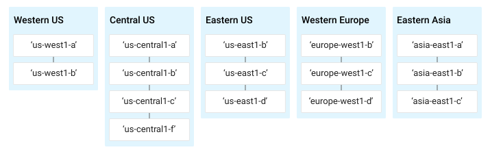

이 문서는 [여기](http://googlegenomics.readthedocs.io/en/latest/use_cases/run_samtools_over_many_files/index.html)의 문서를 간략하게 한글로 번역 정리 한 것이다.
# 클라우드 스토리지에서 SAMtools 를 이용하여 BAM 파일 인덱스 만들기.
만약 수천개의 BAM 파일이 있고 이 파일들 모두를 구글 클라우드 저장소에서 인덱스 파일 (BAI) 을 만들어야 한다면?

[Grid Computing Tools github](https://github.com/googlegenomics/grid-computing-tools) 에서는 이를 위한 코드들을 제공하고 있다.

## Overview
아래의 두개의 기술 덕분에 많은 수의 파일들을 처리할 수 가 있다.
* [Google Compute Engine](https://cloud.google.com/compute/)
* [Grid Engine (SGE)](http://gridengine.info/)

Google Compute Engine 을 통해서는 VM을 사용해서 수십에서 수백개의 인스턴스를 사용할 수 있다.

Grid Engine 을 통해서는 생성한 인스턴스 위에서 각종 작업들을 할 수 있다.

## Directory structure
이 도구들을 사용하기 위해서 내 컴퓨터에 [Grid Computing Tools github](https://github.com/googlegenomics/grid-computing-tools) 와 [Elasticluster repo](https://github.com/gc3-uzh-ch/elasticluster)를 내려받아야 한다.

그리고 아래의 두개의 디렉토리는 workspace root(`WS_ROOT`)에 같이 있는 것으로 가정한다.

* `grid-computing-tools`
* `elasticluster`

## Running the samples

아래의 예에서는 3개의 worker 인스턴스에서 6개의 파일을 가지고 `samtools` 실습을 한다. (BAM 파일은 public repo에 있는 BAM 파일 사용)

1. grid engine을 사용하는 google compute engine 클러스터를 생성한다.
    shell 에서 :
    1. cd ${WS_ROOT}
    1. [Create a Grid Engine cluster on Compute Engine](http://googlegenomics.readthedocs.io/en/latest/use_cases/setup_gridengine_cluster_on_compute_engine/index.html) 의 링크의 내용을 따라서 클러스터를 생성한다.
1. `grid-computing-tools` repository 를 내려받는다.
```
cd ${WS_ROOT}
git clone https://github.com/googlegenomics/grid-computing-tools.git
```
1. `src` and `samples`  디렉토리들을 Grid Engine master instance 에 올린다.
```
cd grid-computing-tools
elasticluster sftp gridengine << 'EOF'
mkdir src
mkdir src/common
mkdir src/samtools
put src/common/* src/common/
put src/samtools/* src/samtools/
mkdir samples
mkdir samples/samtools
put samples/samtools/* samples/samtools/
EOF
```
1. 마스터 인스턴스에 SSH 한다.
```
elasticluster ssh gridengine
```
1. 샘플들을 작업하기 위한 설정 파일을 만든다. (참조: `grid-computing-tools/samples/samtools/samtools_index_config.sh`)
The syntax for running the sample is:
```
./src/samtools/launch_samtools.sh [config_file]
```
`config_file` 에는 두가지 종류의 인자가 정의 되어 있어야 한다.
    * 실행하려는 operation 종류
    * 원본 파일들과 생성 파일들이 저장될 공간
operation 종류는 아래와 같이 정하면 된다.
    * SAMTOOLS_OPERATION: `index`
공간의 위치는 다음과 같이 정의 한다.
    * INPUT_LIST_FILE: `Google Cloud Storage` 에 있는 파일 이름
    * OUTPUT_PATH: `Google Cloud Storage` path <- 결과 파일을 올리는 경로.
    * OUTPUT_LOG_PATH: (optional) GCS path indicating where to upload log files
1. Run the sample:
아래와 같이 실행한다.
```
./src/samtools/launch_samtools.sh ./samples/samtools/samtools_index_config.sh
```
성공적으로 launch되면 아래와 같은 메시지가 출력 된다.
```
Your job-array 1.1-6:1 ("samtools") has been submitted
This message tells you that the submitted job is a gridengine array job. The above message indicates that the job id is 1 and that the tasks are numbered 1 through 6. The name of the job samtools is also indicated.
```
1. Monitoring the status of your job
`qstat`이라는 명령어를 사용해서 클러스터에 제출된 작업들의 상태를 확인 할 수 있다.
1. Destroying the cluster
```
elasticluster stop gridengine
```

## Running your own job
이제는 자신의 BAM 파일을 작업할 차례이다. 그 때 추가로 필요한 사항들은 다음과 같다.
1. Create an input list file
1. Create a job config file
1. Create a gridengine cluster with sufficient disk space attached to each compute node
1. Upload input list file, config file, and grid-computing-tools source to the gridengine cluster master
1. Do a “dry run” (optional)
1. Do a “test run” (optional)
1. Launch the job

이중에서 가장 중요해 보이는 충분한 디스크 확보에 대해서 살펴본다. 나머지는 [원본](http://googlegenomics.readthedocs.io/en/latest/use_cases/run_samtools_over_many_files/index.html) 문서를 참조하면 쉽게 따라할 수 있다.

** Create a gridengine cluster with sufficient disk space attached to each compute node **

- Determine disk size requirements

elasticluster를 이용해서 노드를 만들면 기본이 10GB 의 저장용량을 갖는다 [참조](http://googlegenomics.readthedocs.io/en/latest/use_cases/setup_gridengine_cluster_on_compute_engine/index.html#elasticluster-config-boot-disk).
경우에 따라 계산 노드의 저장 용량 등을 조절할 필요가 있는데 google cloud 에서는 여러가지 종류의 storage를 제공하고 있으니 이에 따라 선택하여야 한다 [참고: selecting the right persistent disk](https://cloud.google.com/compute/docs/tutorials/compute-engine-disks-price-performance-and-persistence#selecting_the_right_disk).

- Verify or increase quota

Quota 제한과 현재 사용량은 다음의 `gcloud compute` 명령어를 통해 볼 수 있다:
```
gcloud compute regions describe *region*
```
> region은 [https://cloud.google.com/compute/docs/regions-zones/regions-zones](https://cloud.google.com/compute/docs/regions-zones/regions-zones)에 가면 볼 수 있다.


또는 `Cloud Platform Console`에서 확인 할 수 있다.

[https://console.cloud.google.com/project/_/compute/quotas](https://console.cloud.google.com/project/_/compute/quotas)

중요하게 볼 것은 CPUs, in-use IP addresses, disk size 들이다.

쿼터를 추가하고 싶으면 [Compute Engine quota request form](https://docs.google.com/a/google.com/forms/d/1vb2MkAr9JcHrp6myQ3oTxCyBv2c7Iyc5wqIKqE3K4IE/viewform) 을 작성하면 된다.

- Configure your cluster

elasticluster의 configure 파일에 [참조](http://googlegenomics.readthedocs.io/en/latest/use_cases/setup_gridengine_cluster_on_compute_engine/index.html#elasticluster-config-boot-disk) 처럼 세팅하고 부팅하면 된다.
